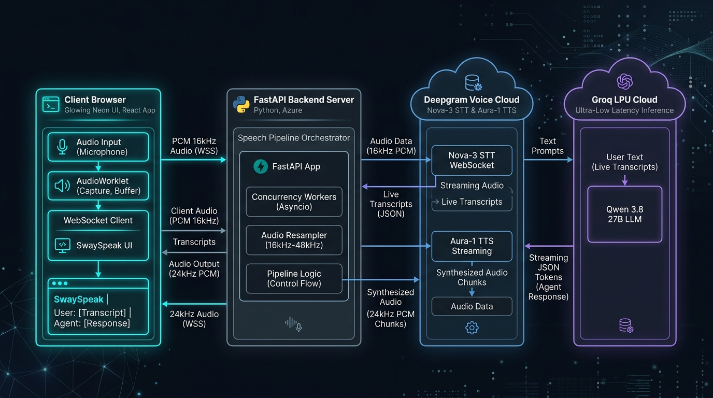
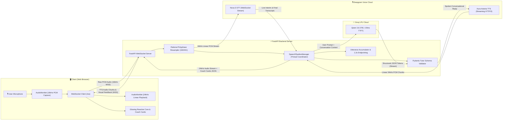
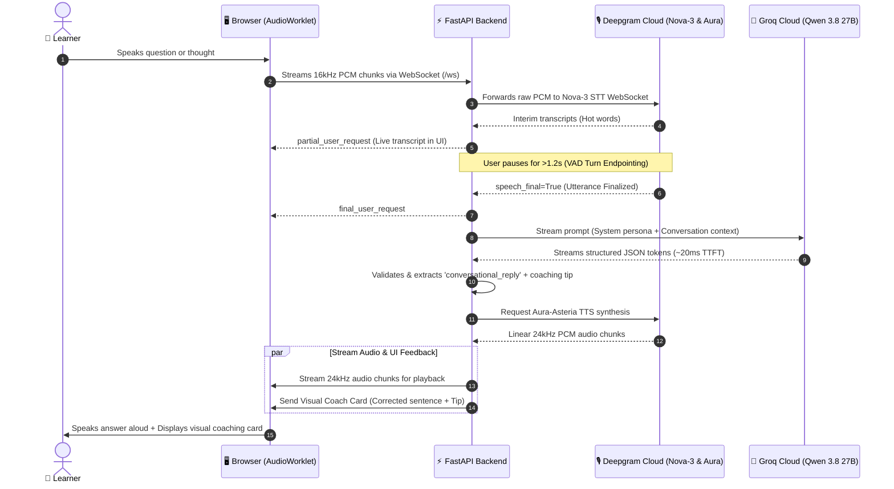

# SwaySpeak: Interactive AI English Tutor 🗣️💡

[](https://swayspeak.onrender.com)
[](https://github.com/Mani1454/swayspeak)
[](https://python.org)
[](https://fastapi.tiangolo.com)
[](https://deepgram.com)
[](https://groq.com)

A high-performance, ultra-low latency **interactive English conversation coach** designed for real-time spoken practice.  
Built for **natural conversation, real-time grammar coaching, and confidence building**.

Runs smoothly on standard consumer laptops or cloud CPU containers using the world's fastest streaming voice and LLM APIs — **no GPU required**.

---

## 🚀 Try It Now

* 👉 **[Live Cloud Web App (Render)](https://swayspeak.onrender.com)** — *Open in any modern browser, tap the glowing core, and start speaking!*
* 👉 **[Local Development Server](http://127.0.0.1:8000)** — *When running the local backend.*

---

## ⚡ Key Capabilities

* 🗣️ **Two-Part Spoken Response Architecture**:
  1. **Warm Spoken Coaching**: Sway gently speaks natural phrasing corrections and concise tips first.
  2. **Direct, Helpful Answers**: Sway directly answers your questions (travel recommendations, grammar doubts like *"didn't get it"* vs *"didn't got it"*, culture, daily advice) instead of deflecting with canned lines!
* 📋 **Visual English Coach Cards**: Real-time display showing "What You Should Have Spoken", sentence improvements, and grammar explanations in the web UI.
* ⏱️ **Patient 1.2s Turn Endpointing**: Allows natural pauses between thoughts (up to 1.2 seconds) so you can articulate freely without being cut off mid-sentence.
* 🎙️ **Dynamic Rational Audio Resampling**: Exact rational factor polyphase resampling (`160/441`) automatically reconciles 44.1kHz / 48kHz soundcards with Deepgram's 16kHz engine, eliminating pitch distortion and phoneme warping.
* ⚡ **Sub-Second Voice Latency**: Streaming LLM token generation coupled with instant first-chunk TTS synthesis produces responses at conversational human speed (~600–900ms).
* 🛑 **Instant Barge-In Interruptibility**: Interrupt Sway naturally at any moment; speech generation and playback cancel instantly when you start speaking.
* 🧹 **Clean Session Privacy**: Fresh conversation memory per session with one-click context clearing.

---

## 🏗️ System Architecture & Communication Flow



### 🔄 End-to-End Component Flowchart



### ⏱️ Turn Lifecycle Sequence Diagram



### 🛠️ Technology Stack Breakdown

| Layer | Technology | Details |
| :--- | :--- | :--- |
| **STT (Speech-to-Text)** | **Deepgram Nova-3** | Real-time streaming WebSocket STT with punctuation, numerals, and 1200ms endpointing. |
| **LLM Engine** | **Qwen 3.8 27B on Groq** | High-throughput LPU inference (~20ms TTFT) with strict structured JSON output. |
| **TTS (Text-to-Speech)**| **Deepgram Aura (Asteria)**| Ultra-low latency conversational female voice streaming 24kHz linear PCM audio. |
| **Server Backend** | **FastAPI + Uvicorn** | Asynchronous Python WebSocket server managing worker threads and audio streams. |
| **Audio Pipeline** | **Web Audio AudioWorklet** | Zero-latency PCM recording and playback directly on the browser's audio render thread. |

---

## 📂 Project Structure

```
swayspeak/
├── code/
│   ├── server.py                   # FastAPI server, WebSocket routing & audio buffers
│   ├── speech_pipeline_manager.py  # Concurrency coordinator (listening, thinking, speaking)
│   ├── transcribe.py               # Deepgram Nova-3 live streaming STT client
│   ├── audio_in.py                 # Rational resampler & mic stream processor
│   ├── audio_module.py             # Deepgram Aura TTS audio streaming engine
│   ├── llm_module.py               # Groq LLM integration with Qwen 3.8 27B & fallback logic
│   ├── tutor_schema.py             # Pydantic schema for structured coaching JSON
│   ├── system_prompt.txt           # Sway English tutor persona & coaching instructions
│   └── static/
│       ├── index.html              # Futuristic glowing core interface
│       ├── app.js                  # Frontend WebSocket client & audio coordinator
│       ├── pcmWorkletProcessor.js  # AudioWorklet for low-latency mic capture
│       ├── ttsPlaybackProcessor.js # AudioWorklet for seamless audio playback
│       └── swayspeak_logo.png      # SwaySpeak branding logo
├── Dockerfile                      # Production Docker container definition
├── render.yaml                     # Render Infrastructure as Code configuration
├── requirements.txt                # Python dependencies
├── start_windows.bat               # Windows one-click local launcher
├── start_unix.sh                   # Linux/macOS one-click local launcher
└── README.md                       # Documentation
```

---

## 💻 Running Locally

### Option A: One-Click Launchers

#### **Windows**
1. Clone or download the repository:
   ```cmd
   git clone https://github.com/Mani1454/swayspeak.git
   cd swayspeak
   ```
2. Double-click `start_windows.bat`.  
   *It automatically activates the environment, installs dependencies, and opens `http://127.0.0.1:8000`.*

#### **macOS / Linux**
1. Clone the repository and navigate into the folder:
   ```sh
   git clone https://github.com/Mani1454/swayspeak.git
   cd swayspeak
   ```
2. Run:
   ```sh
   chmod +x start_unix.sh
   ./start_unix.sh
   ```

---

### Option B: Manual Setup (For Developers)

1. **Create and activate a virtual environment**:
   ```sh
   python -m venv venv
   # On Windows:
   venv\Scripts\activate
   # On macOS/Linux:
   source venv/bin/activate
   ```

2. **Install dependencies**:
   ```sh
   pip install -r requirements.txt
   ```

3. **Configure Environment Variables**:
   Create a `.enve` file in the root directory (or set system environment variables):
   ```env
   # API Keys
   DEEPGRAM_API_KEY=your_deepgram_api_key
   GROQ_API_KEY=your_groq_api_key

   # Voice & Model Configuration
   DEEPGRAM_STT_MODEL=nova-3
   DEEPGRAM_TTS_MODEL=aura-asteria-en
   DEEPGRAM_TTS_SAMPLE_RATE=24000

   # LLM Configuration
   LLM_PROVIDER=groq
   LLM_MODEL=qwen/qwen3.8-27b
   GROQ_MODEL=qwen/qwen3.8-27b

   # Pipeline
   STT_BACKEND=deepgram
   TTS_ENGINE=deepgram
   ```

4. **Launch the Server**:
   ```sh
   cd code
   python server.py
   ```
5. Open **`http://127.0.0.1:8000`** in your browser.

---

### Option C: Docker Deployment

You can run SwaySpeak anywhere using Docker:

```sh
docker build -t swayspeak .
docker run -p 8000:8000 --env-file .enve swayspeak
```

---

## ⚙️ Environment Variables Reference

| Variable | Description | Default |
| :--- | :--- | :--- |
| `DEEPGRAM_API_KEY` | Deepgram API Key (STT & TTS) | Required |
| `GROQ_API_KEY` | Groq Cloud API Key (LLM) | Required |
| `DEEPGRAM_STT_MODEL` | Deepgram speech recognition model | `nova-3` |
| `DEEPGRAM_TTS_MODEL` | Deepgram voice synthesis persona | `aura-asteria-en` |
| `DEEPGRAM_TTS_SAMPLE_RATE` | Deepgram TTS output sampling rate | `24000` |
| `LLM_PROVIDER` | Primary LLM backend (`groq`, `openai`) | `groq` |
| `LLM_MODEL` | Active LLM model identifier | `qwen/qwen3.8-27b` |
| `STT_BACKEND` | Active STT engine | `deepgram` |
| `TTS_ENGINE` | Active TTS engine | `deepgram` |

---

## 👨‍💻 Developed By

**Manish Kumar**  
🚀 *Building the future of ambient voice AI and natural language learning.*  
GitHub: [@Mani1454](https://github.com/Mani1454)  
Live App: [https://swayspeak.onrender.com](https://swayspeak.onrender.com)

